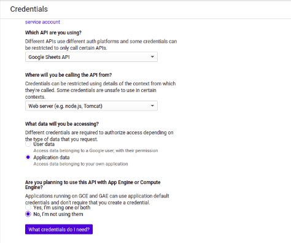

# azure-python

Get the closed Workitems from devops azure and store into google spreadSheet

-----------------------------

- Login into developers google console

https://console.developers.google.com/apis/dashboard

- enable Apis and services 


- Search for google sheet and google drive and Enable Both

| Google Drive Api| Google SpreadSheet Api|
|------------|-------------|
|  |  |


- create credentials to get credentials for api use 


- choose option as per requirments
 


- create a service account with the role of -> project -> owner


- Download a json file with all credentials and paste all data of this file into credentials.json file of this project

- make a google spreadsheet editable by share that sheet with client_email provided into  credentials.json

- install python requirements
```
pip3 install -r requirement.txt                   
```

- set all settings of devops azure into settings.py file

- run main.py
```
python3 main.py
```

- it will schedule the action of fetching data and storing into google spreadsheet at 23:59 every day

- now it will fetch all closed workitems expect tasks and store into sheet but you can do so many things by adding your own methods into AzureData Class
